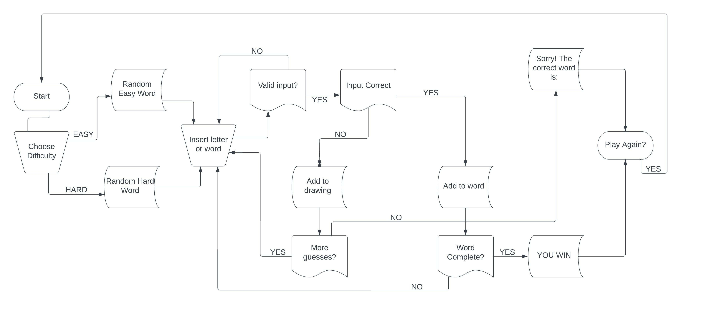

# Table of contents

  ##  Plans and structure
  
   ###   Objectives
   Make a working Hangwoman game. Complete with replay and instructions. 
   I chose to have two different wordlists, one easy and one hard. 
    
   ###    Changes throughout the process
   Considered adding a colour scheme but it didnt look right to me. 
  
   ## Features
   ####    Welcome page
   Welcome! Would you like instructions? Press Y for Yes and N for No.
   ####     Instructions
   To play hangwoman, you need to guess the word one letter at a time.
   Press a letter and hit enter. If correct it gets added to the word.
   If your guess is wrong a part of the hangwoman image will be added.
   Keep guessing until you get the whole word or you run out of tries.
   ####    Game
   ####     Losing message
   Sorry! Better luck next time.
   ####     Winning message
   WOHO! The word was: {pick}. You win!

   ## Testing
   ###     Python
   Tested with pep8.
   ###     Manual Testing
   ###     Bugs
   I couldnt get it to work in time. I watched so many videos i got everything confused and scrambled. 
   ### Deployment
   Deployed on Heroku and github.
   ### Finished product

   
   ### Credits

   Diagram made with https://lucid.app.
   Hard words picked from https://www.hangmanwords.com/words
   Watched many different videos on youtube to see different ways to create the game
   Table of contents list copied from et9719 Hangman project. 
   As always i would never have gotten this far without my mentor. 
